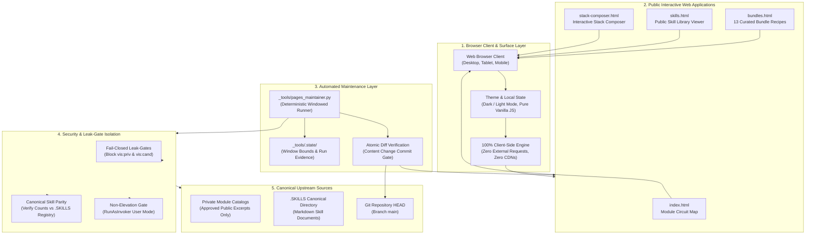
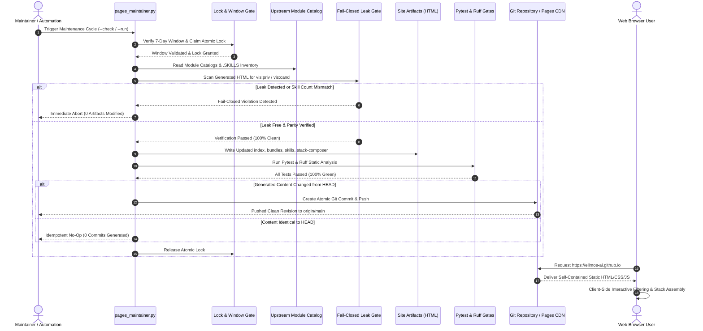

# ellmos-ai.github.io — Interactive Public Maps of the ellmos Ecosystem

**Official public web portal, interactive module circuit diagrams, bundle recipes, skill directory, and visual stack composer for the modular ellmos AI framework.**

<p align="center">
  <a href="https://github.com/ellmos-ai/ellmos-ai.github.io"></a>
  <a href="https://github.com/ellmos-ai/ellmos-ai.github.io/actions/workflows/ci.yml"></a>
  <a href="tests/"></a>
  <a href="https://www.python.org"></a>
  <a href="https://github.com/ellmos-ai/ellmos-ai.github.io"></a>
  <a href="https://ellmos-ai.github.io"></a>
  <a href="SECURITY.md"></a>
  <a href="SECURITY.md"></a>
  <a href="SECURITY.md"></a>
  <a href="https://github.com/astral-sh/ruff"></a>
  <a href="https://github.com/ellmos-ai"></a>
  <a href="https://github.com/open-bricks"></a>
  <a href="llms.txt"></a>
  <a href="https://github.com/ellmos-ai/ellmos-ai.github.io"></a>
  <a href="LICENSE"></a>
</p>

<p align="center"><strong>English</strong> · <a href="README_de.md">Deutsch</a> · <a href="https://ellmos-ai.github.io">Live Site</a></p>

> [!NOTE]
> For AI agent context, automated crawler schemas, and architectural invariants, see [`llms.txt`](llms.txt).
> All deployed web pages execute 100% offline inside the client's browser with zero external telemetry, zero tracking, and zero third-party CDNs.

---

## Quick Navigation

- [1. Features & Core Capabilities](#1-features)
- [2. System Architecture & Topology](#2-architecture)
- [3. Target Personas & Discoverability](#3-target-personas--discoverability)
- [4. Comparative Matrix vs. Alternatives](#4-comparative-matrix-vs-alternatives)
- [5. Dual Mermaid Diagrams](#5-dual-mermaid-diagrams)
- [6. Governance & Runtime Invariants](#6-governance--runtime-invariants)
- [7. Interactive Web Applications Matrix](#7-interactive-web-applications-matrix)
- [8. Module Circuit Map Deep Dive](#8-module-circuit-map-deep-dive)
- [9. Curated Bundle Recipes](#9-curated-bundle-recipes)
- [10. Public Skill Library Viewer](#10-public-skill-library-viewer)
- [11. Interactive Stack Composer Canvas](#11-interactive-stack-composer-canvas)
- [12. Pages Maintainer Automation & Leak-Gates](#12-pages-maintainer-automation--leak-gates)
- [13. Verification, Testing & Quality Gates](#13-verification-testing--quality-gates)
- [14. Sibling Ecosystem & Cross-Project Topology](#14-sibling-ecosystem--cross-project-topology)
- [15. Third-Party Licenses & Open-Source Auditing](#15-third-party-licenses--open-source-auditing)
- [16. Machine-Readable LLM Context & Agent Protocol](#16-machine-readable-llm-context--agent-protocol)
- [17. Changelog & Project History](#17-changelog--project-history)
- [18. Security Policy & Statutory Notice](#18-security-policy--statutory-notice)

---

<a id="1-features"></a>
<a id="features"></a>
<a id="key-features"></a>
<a id="1-funktionen"></a>
<a id="funktionen"></a>
<a id="hauptfunktionen"></a>
## 1. Features & Core Capabilities

Live at **https://ellmos-ai.github.io**

`ellmos-ai.github.io` serves as the public graphical surface of the ellmos modular construction kit. It translates internal module registries, composition recipes, and AI agent skills into human- and machine-readable static web experiences:

1. **Module Circuit Map** ([`index.html`](https://ellmos-ai.github.io)): Visual, categorized circuit diagram illustrating how modules (MCP servers, proxies, runners, tools) connect and exchange information.
2. **Bundle Recipes** ([`bundles.html`](https://ellmos-ai.github.io/bundles.html)): Interactive walkthrough of 13 curated deployment recipes, detailing required and optional components for specific agent profiles.
3. **Skill Library** ([`skills.html`](https://ellmos-ai.github.io/skills.html)): Searchable, live catalog of public agent skills (`SKILL.md`) with built-in viewer and clipboard integration.
4. **Stack Composer** ([`stack-composer.html`](https://ellmos-ai.github.io/stack-composer.html)): Interactive visual assembly tool enabling developers to compose valid module stacks with live rule enforcement and export to standard `stack.v2.json`.
5. **Zero-Egress Static Privacy**: Pure HTML5/CSS3/Vanilla JS execution in the user's browser with 0 external requests and 0 third-party CDNs.
6. **Bilingual Navigation Parity**: Symmetrical documentation and reciprocal HTML anchor aliases across English and German.

---

<a id="2-architecture"></a>
<a id="architecture"></a>
<a id="system-architecture"></a>
<a id="system-architecture--dataflow"></a>
<a id="2-architektur"></a>
<a id="architektur"></a>
<a id="systemarchitektur"></a>
<a id="systemarchitektur--datenfluss"></a>
## 2. System Architecture & Topology

The `ellmos-ai.github.io` static delivery architecture bridges local development repositories, canonical skill catalogs, automated leak gates, and GitHub Pages CDN edge delivery:

- **Surface Layer (Browser Client)**: Renders static DOM, handles client-side filtering, theme switching (dark/light), and stack composition entirely in local memory.
- **Artifact Layer (Static Web Applications)**: Self-contained HTML/CSS/JS bundles (`index.html`, `bundles.html`, `skills.html`, `stack-composer.html`, `.nojekyll`) with zero server-side state.
- **Maintainer Layer (`_tools/pages_maintainer.py`)**: Deterministic runner executing on 7-day windows anchored to Mondays, verifying skill parity and enforcing fail-closed leak gates.
- **Security Isolation Layer**: Validates that no draft or private modules (`vis:"priv"`, `vis:"cand"`) leak into public artifacts.
- **Upstream Data Sources**: Consumes canonical approved excerpts from `.SKILLS` registries and module configuration schemas.

---

<a id="3-target-personas--discoverability"></a>
<a id="target-personas"></a>
<a id="discoverability"></a>
<a id="3-zielgruppen-personas--auffindbarkeit"></a>
<a id="zielgruppen-personas"></a>
<a id="auffindbarkeit"></a>
## 3. Target Personas & Discoverability

`ellmos-ai.github.io` is engineered to solve concrete workflow bottlenecks for four key audiences:

### `[PERSONA-01]` Autonomous AI Agent Architects & Operators
- **Role**: AI Infrastructure Engineers, Multi-Agent Swarm Designers (Gemini, Claude Code, Codex).
- **Pain Point**: Fragmented, out-of-date agent skill registries and lack of standardized JSON stack declarations for autonomous workers.
- **Solution**: Centralized, machine-readable [`llms.txt`](llms.txt), validated `SKILL.md` library viewer, and exportable `stack.v2.json` schema definitions.
- **Typical Workflow**: Consult `llms.txt` -> search `skills.html` for domain skills -> assemble stack in `stack-composer.html` -> export `stack.v2.json` -> deploy to agent runner.
- **High-Intent Search Queries**:
  * *"modular AI agent stack composer"*
  * *"machine-readable agent skills repository"*
  * *"MCP server ecosystem interactive map"*
  * *"standardized agent recipe stack.v2.json"*

### `[PERSONA-02]` Modular System Engineers & Developers
- **Role**: Backend & Tooling Engineers building decoupled AI extensions and MCP servers.
- **Pain Point**: Difficulty visualizing how disparate tools, proxies, and executors fit together in an agent runtime.
- **Solution**: Visual circuit map with domain clustering, input/output port definitions, and clear module categorization.
- **Typical Workflow**: Open `index.html` -> filter by functional cluster (e.g., Code & Development) -> inspect module tooltips -> verify compatibility.
- **High-Intent Search Queries**:
  * *"visual MCP server dependency diagram"*
  * *"modular AI tooling circuit map"*
  * *"open-bricks agent architecture map"*
  * *"local-first AI agent module registry"*

### `[PERSONA-03]` Prompt Engineers & AI Workflow Designers
- **Role**: Prompt Engineers, AI Team Leads, and Domain Specialists authoring specialized agent capabilities.
- **Pain Point**: Hunting through git repositories to find copyable, compliant agent system instructions and tool definitions.
- **Solution**: Interactive `skills.html` with real-time text search, category tabs, formatted markdown preview, and one-click copy to clipboard.
- **Typical Workflow**: Browse `skills.html` -> filter by category -> preview instructions -> click *Copy Markdown* -> paste into system prompt.
- **High-Intent Search Queries**:
  * *"agent skill library markdown browser"*
  * *"curated system prompt bundle recipes"*
  * *"offline AI agent skill catalog"*
  * *"copyable SKILL.md template directory"*

### `[PERSONA-04]` Security & Compliance Officers
- **Role**: Information Security Auditors, Privacy Officers, and Enterprise Compliance Architects.
- **Pain Point**: Third-party SaaS tools transmitting intellectual property, browsing habits, or stack blueprints to cloud analytics.
- **Solution**: 100% zero-egress guarantee (`INV-STATIC-01`), client-side DOM processing, fail-closed leak-gates (`INV-LEAK-02`), and unprivileged user-mode execution (`INV-RUNAS-04`).
- **Typical Workflow**: Review [`SECURITY.md`](SECURITY.md) and [`THIRD_PARTY_LICENSES.md`](THIRD_PARTY_LICENSES.md) -> audit network tab in DevTools -> verify 0 external requests.
- **High-Intent Search Queries**:
  * *"zero egress static agent architecture visualizer"*
  * *"privacy preserving local-first AI documentation"*
  * *"fail-closed leak gate static site generator"*
  * *"air-gapped compatible AI tool catalog"*

---

<a id="4-comparative-matrix-vs-alternatives"></a>
<a id="comparative-matrix"></a>
<a id="4-vergleichsmatrix-vs-alternativen"></a>
<a id="vergleichsmatrix"></a>
## 4. Comparative Matrix vs. Alternatives

The following matrix contrasts `ellmos-ai.github.io` with traditional developer portals and AI registries across 10 architectural dimensions mapped directly to runtime invariants:

| Comparative Dimension | Runtime Invariant | `ellmos-ai.github.io` | Cloud API / Agent Hubs (e.g. HuggingFace, LangSmith) | Static Doc Generators (e.g. Docusaurus, MkDocs) | Heavy Dynamic SPAs (e.g. Next.js on Vercel) | Unstructured GitHub README Collections |
|---|---|---|---|---|---|---|
| **1. Network Egress & Telemetry** | `INV-STATIC-01` | **100% Zero-Egress** (0 CDNs, 0 analytics, 0 cookies) | Heavy tracking, session cookies, external API telemetry | Often includes Google Analytics, web fonts, CDNs | Dynamic API calls, server-side logs, cookies | Minimal, but lacks interactive tooling |
| **2. Leak Prevention & Visibility Gates** | `INV-LEAK-02` | **Fail-Closed Leak-Gates** (strict `vis:priv`/`vis:cand` check) | Manual publishing or public-by-default exposure | No native leak-gate; relies on manual file exclusion | Dependent on complex backend ACLs and middleware | Prone to accidental commits of private drafts |
| **3. Catalog & Skill Synchronization** | `INV-CATALOG-03` | **Exact Canonical Parity** (synchronized with `.SKILLS`) | Central cloud database drift vs local files | Static markdown drift unless manually regenerated | Database sync lag or disconnected API stubs | Frequent desynchronization and broken links |
| **4. Execution Privilege Mode** | `INV-RUNAS-04` | **Unprivileged User Mode** (`RunAsInvoker`, 0 admin rights) | Cloud container root / elevated server runtimes | Standard CLI, but often requires global npm packages | Requires Node.js server daemons and root containers | None (raw git text) |
| **5. Maintenance Cadence** | `INV-WINDOW-05` | **Deterministic 7-Day Window** (anchored to Mondays) | Ad-hoc or continuous trigger churn | Manual rebuilds on every documentation typo | Automated CI/CD webhooks with frequent rebuilds | Irregular, untracked manual edits |
| **6. Atomic Git History** | `INV-DIFF-06` | **Atomic Content Commits** (commits only on content diff) | Opaque database revisions | Empty commits or timestamp churn common | Frequent automated deployment commits | High noise of minor documentation commits |
| **7. Multi-Agent Concurrency** | `INV-LOCK-07` | **Fail-Closed Lock Protocol** (`LOCK.pages-maintainer.txt`) | Database row-locks or optimistic concurrency | No concurrency protection for local multi-agent runs | Distributed Redis locks or database locking | Prone to merge conflicts across agent swarms |
| **8. Multi-OS CI Validation** | `INV-OS-08` | **Triple OS Matrix** (Ubuntu, Windows, macOS; Py 3.10-3.13) | Typically Linux-only cloud container builds | Often tested on single OS platform | Tested on Linux runner environments | Rarely tested with automated test suites |
| **9. Offline Client Autonomy** | `INV-CLIENT-09` | **100% Pure Client-Side JS** (full functionality offline) | Breaks completely without internet connectivity | Readable offline, but search often needs server index | Breaks without active backend server | Readable offline, but zero interactive features |
| **10. Security & Triage SLA** | `INV-SLA-10` | **Binding 48h Response / 5d Triage SLA** (SECURITY.md) | Standard enterprise ticket queues or best-effort | Open-source best-effort, no formal SLA | Platform provider SLA, not repository-specific | No defined security commitments |

---

<a id="5-dual-mermaid-diagrams"></a>
<a id="diagrams"></a>
<a id="mermaid-diagrams"></a>
<a id="5-duale-mermaid-diagramme"></a>
<a id="duale-diagramme"></a>
<a id="mermaid-diagramme"></a>
## 5. Dual Mermaid Diagrams

### Architecture Topology Diagram



### Maintenance & Publication Lifecycle Sequence



---

<a id="6-governance--runtime-invariants"></a>
<a id="invariants"></a>
<a id="governance"></a>
<a id="6-governance--laufzeitinvarianten"></a>
<a id="laufzeitinvarianten"></a>
## 6. Governance & Runtime Invariants

The project strictly guarantees 10 operational and architectural invariants:

| Invariant ID | Guarantee | Specification & Implementation Details | Security & Operational Benefit |
|---|---|---|---|
| `INV-STATIC-01` | **100% Static & Zero Network Egress** | All deployed pages (`index.html`, `bundles.html`, `skills.html`, `stack-composer.html`) are self-contained static HTML/CSS/JavaScript documents. Zero external telemetry, zero tracking scripts, zero user analytics, and zero external third-party CDN dependencies. | Complete user confidentiality; client browsing patterns and composed stacks never leave the user's device. |
| `INV-LEAK-02` | **Fail-Closed Leak-Gates** | The maintainer suite (`_tools/pages_maintainer.py`) strictly validates public site artifacts against canonical catalogs before publication. Private module identifiers and non-public visibility markers (`vis:"priv"`, `vis:"cand"`) trigger an immediate fail-closed abort. | Absolute prevention of unintended intellectual property or internal architecture exposure. |
| `INV-CATALOG-03` | **Canonical Catalog Parity** | Skill catalog counts and module inventories must strictly match canonical `.SKILLS` and module registry definitions. Any discrepancy halts the generation process. | Guarantees public documentation remains 100% synchronized with actual framework capabilities. |
| `INV-RUNAS-04` | **Local-First & Non-Elevation (User Mode)** | All build and maintenance scripts run completely unprivileged in standard user space (`RunAsInvoker`). Administrator or root privileges are never requested, required, or assumed. | Safe, least-privilege operation preventing privilege escalation risks across developer workstations and CI runners. |
| `INV-WINDOW-05` | **Deterministic 7-Day Window Cadence** | Automated site maintenance is strictly bounded by deterministic 7-day windows anchored to Mondays, synchronized with `system-auditor` evidence runs. | Predictable maintenance intervals without uncontrolled churn or erratic micro-commits. |
| `INV-DIFF-06` | **Atomic Content-Change Commits** | Git commits are generated exclusively when verified, leak-free site content has actually changed from HEAD, preventing noisy empty commits. | Clean, meaningful commit history with zero ghost revisions or timestamp-only drift. |
| `INV-LOCK-07` | **Fail-Closed Lock Discipline** | Repository and workspace lock semantics (`LOCK.pages-maintainer.txt`, canonical LOCK rules) are enforced to ensure atomic runs and eliminate race conditions across multi-agent environments. | Zero file corruption or conflicting simultaneous generator executions across autonomous agent swarms. |
| `INV-OS-08` | **Multi-OS Platform Parity & Smoke Integrity** | Automated GitHub Actions CI workflow runs on `ubuntu-latest`, `windows-latest`, and `macos-latest` across Python 3.10-3.13 with bytecode compilation gates and Ruff linter. | Seamless cross-platform reliability for all maintainer scripts and verification fixtures. |
| `INV-CLIENT-09` | **Pure Client-Side Static Execution** | Dark/light theme toggles, circuit map filtering, bundle recipe inspection, and stack composer logic run 100% in client-side JavaScript without backend servers or server-side state. | Ultra-fast page response times, zero server infrastructure costs, and resilient offline utility. |
| `INV-SLA-10` | **48h Response & 5-Day Triage SLA** | Mandatory 48-hour response SLA for initial vulnerability acknowledgment and 5 business days for complete triage assessment. | Predictable, enterprise-grade security response and responsible vulnerability disclosure process. |

---

<a id="7-interactive-web-applications-matrix"></a>
<a id="pages--features-matrix"></a>
<a id="pages-matrix"></a>
<a id="7-interaktive-web-anwendungs-matrix"></a>
<a id="web-anwendungs-matrix"></a>
## 7. Interactive Web Applications Matrix

| Page | File | Primary Features | Target Audience | Privacy & Execution |
|---|---|---|---|---|
| **Module Circuit Map** | [`index.html`](https://ellmos-ai.github.io) | Visual diagram of functional ecosystem clusters, module search, purpose tooltips, bilingual descriptions. | Developers, Architects, AI Agents | 100% client-side rendering, zero telemetry |
| **Bundle Recipes** | [`bundles.html`](https://ellmos-ai.github.io/bundles.html) | 13 pre-composed ecosystem recipes, component breakdown, module tiers (required / optional). | System Integrators, Teams | Pure static tables, instant offline filter |
| **Skill Library** | [`skills.html`](https://ellmos-ai.github.io/skills.html) | Direct reader for public `SKILL.md` documents, categorized listing, copy-to-clipboard markdown. | Prompt Engineers, Agents | Local DOM reader, zero external APIs |
| **Stack Composer** | [`stack-composer.html`](https://ellmos-ai.github.io/stack-composer.html) | Visual drag-and-drop stack builder, real-time compatibility rule validation, export to `stack.v2.json`. | Framework Engineers, DevOps | In-browser JSON generation & download |

---

<a id="8-module-circuit-map-deep-dive"></a>
<a id="module-circuit-map"></a>
<a id="8-modul-schaltplan-deep-dive"></a>
<a id="modul-schaltplan"></a>
## 8. Module Circuit Map Deep Dive

The **Module Circuit Map** ([`index.html`](https://ellmos-ai.github.io)) provides an architectural view of the entire ellmos ecosystem:

- **Interactive Categorization**: Groups modules into Infrastructure, Proxies & Routing, Execution Engines, Developer Tooling, and Data Transit.
- **Port Compatibility Visualizer**: Highlights communication channels between client tools and MCP servers.
- **Instant Search & Filter**: Real-time filtering by module name, keyword, or language without server-side processing.
- **Theme Persistence**: Dark and light themes toggled via pure CSS variables with zero tracking cookies.

---

<a id="9-curated-bundle-recipes"></a>
<a id="bundle-recipes"></a>
<a id="9-kuratierte-bundle-rezepte"></a>
<a id="kuratierte-rezepte"></a>
## 9. Curated Bundle Recipes

The **Bundle Recipes** page ([`bundles.html`](https://ellmos-ai.github.io/bundles.html)) documents 13 deployment recipes:

- **Component Tiers**: Distinguishes between foundational core components and domain-specific optional additions.
- **Recipe Manifest**: Defines recipes for Autonomous Coding, Deep Research, Documentation Auditing, and Data Synchronization.
- **Deterministic Stacks**: Guarantees reproducible, conflict-free configurations across different agent runtimes.

---

<a id="10-public-skill-library-viewer"></a>
<a id="skill-library"></a>
<a id="10-oeffentlicher-skill-library-viewer"></a>
<a id="skill-bibliothek"></a>
## 10. Public Skill Library Viewer

The **Skill Library** ([`skills.html`](https://ellmos-ai.github.io/skills.html)) surfaces public agent capabilities:

- **Categorized Index**: Organizes skills into Development, Infrastructure, Utilities, Research, and Education.
- **Inline Markdown Renderer**: Live viewer displaying complete `SKILL.md` instructions directly in the browser.
- **Clipboard Integration**: One-click action to copy raw markdown into autonomous agent instruction contexts.

---

<a id="11-interactive-stack-composer-canvas"></a>
<a id="stack-composer"></a>
<a id="11-interaktiver-stack-composer-canvas"></a>
<a id="stack-composer-canvas"></a>
## 11. Interactive Stack Composer Canvas

The **Stack Composer** ([`stack-composer.html`](https://ellmos-ai.github.io/stack-composer.html)) offers a visual interface for custom agent environments:

- **Drag-and-Drop Assembly**: Intuitive canvas to add, remove, and connect ecosystem modules.
- **Live Rule Validation**: Real-time constraint checking preventing conflicting module combinations.
- **Standardized Export**: Generates validated `stack.v2.json` files ready for deployment to agent runners and local daemons.

---

<a id="12-pages-maintainer-automation--leak-gates"></a>
<a id="pages-maintainer-automation"></a>
<a id="12-pages-maintainer-automation--leak-gates"></a>
<a id="maintainer-automation"></a>
## 12. Pages Maintainer Automation & Leak-Gates

The repository includes a dedicated maintenance tool (`_tools/pages_maintainer.py`) enforcing leak gates and atomic updates:

```powershell
# Preflight check without making modifications
$env:PYTHONIOENCODING='utf-8'
python _tools/pages_maintainer.py --check

# Execute generation and verify site artifacts
python _tools/pages_maintainer.py --run

# Execute generation and push verified changes to origin/main
python _tools/pages_maintainer.py --run --push
```

Fallback automation instructions and scheduling hand-off guidelines are documented in [`_tools/FALLBACK-AUTOMATION.md`](_tools/FALLBACK-AUTOMATION.md).

---

<a id="13-verification-testing--quality-gates"></a>
<a id="verification--testing"></a>
<a id="13-verifikation-tests--qualitaets-gates"></a>
<a id="verifikation--tests"></a>
## 13. Verification, Testing & Quality Gates

The repository enforces automated contract validation via Pytest and Ruff linting:

```powershell
# Run Ruff static code analysis
$env:PYTHONIOENCODING='utf-8'
python -m ruff check .

# Verify Python bytecode integrity
python -m compileall -q _tools tests

# Execute complete automated test suite
python -m pytest -ra -v
```

Verification covers:
- CI workflow configuration and multi-OS matrix (`INV-OS-08`)
- PEP 621 metadata completeness and extended URLs
- Symmetrical 18-point bilingual navigation parity and reciprocal HTML anchors
- Target Personas `[PERSONA-01]` through `[PERSONA-04]` and comparative matrix
- Static site artifact existence, leak-gate invariant enforcement (`INV-LEAK-02`)
- SBOM licensing integrity (`THIRD_PARTY_LICENSES.md`)
- LLM reference integrity (`llms.txt`) and changelog synchronization

---

<a id="14-sibling-ecosystem--cross-project-topology"></a>
<a id="sibling-tools--ecosystem"></a>
<a id="sibling-tools"></a>
<a id="14-geschwister-oekosystem--cross-projekt-topologie"></a>
<a id="geschwister-oekosystem"></a>
## 14. Sibling Ecosystem & Cross-Project Topology

`ellmos-ai.github.io` visually surfaces and interconnects the broader tooling ecosystem across `ellmos-ai`, `dev-bricks`, `file-bricks`, `doc-bricks`, and `open-bricks`:

| Tool | Repository | Focus & Role in Ecosystem |
|---|---|---|
| **coma** | [ellmos-ai/coma](https://github.com/ellmos-ai/coma) | Multi-Agent Job Board & Provider Routing Bridge |
| **clutch** | [ellmos-ai/clutch](https://github.com/ellmos-ai/clutch) | Provider-neutral routing for single tasks |
| **MarbleRun** | [ellmos-ai/MarbleRun](https://github.com/ellmos-ai/MarbleRun) | Sequential agent loops & chain execution |
| **policy-registry** | [ellmos-ai/policy-registry](https://github.com/ellmos-ai/policy-registry) | Policy governance & capability permission authority |
| **system-explorer** | [ellmos-ai/system-explorer](https://github.com/ellmos-ai/system-explorer) | System-wide topology & stack inspection |
| **sqlite-transit-sync** | [ellmos-ai/sqlite-transit-sync](https://github.com/ellmos-ai/sqlite-transit-sync) | Secure SQLite snapshot & sync pipeline |
| **workflowhooker** | [ellmos-ai/workflowhooker](https://github.com/ellmos-ai/workflowhooker) | Workflow hooking & lifecycle event interceptor |
| **memoryhooker** | [ellmos-ai/memoryhooker](https://github.com/ellmos-ai/memoryhooker) | Agent memory injection & provenance tracking |
| **swarm_ai** | [ellmos-ai/swarm_ai](https://github.com/ellmos-ai/swarm_ai) | LLM swarm intelligence & consensus voting toolkit |
| **ellmos-filecommander-mcp** | [ellmos-ai/ellmos-filecommander-mcp](https://github.com/ellmos-ai/ellmos-filecommander-mcp) | Local-First FileCommander MCP Server |
| **ellmos-codecommander-mcp** | [ellmos-ai/ellmos-codecommander-mcp](https://github.com/ellmos-ai/ellmos-codecommander-mcp) | Local-First CodeCommander MCP Server |
| **ellmos-controlcenter-mcp** | [ellmos-ai/ellmos-controlcenter-mcp](https://github.com/ellmos-ai/ellmos-controlcenter-mcp) | Unified AI Tools & Profiles Control Center MCP |
| **DevCenter** | [dev-bricks/DevCenter](https://github.com/dev-bricks/DevCenter) | Developer workstation hub & process control |
| **CodeBox** | [dev-bricks/CodeBox](https://github.com/dev-bricks/CodeBox) | Multi-language code runner & plugin platform |
| **ProFiler** | [file-bricks/ProFiler](https://github.com/file-bricks/ProFiler) | Local-First file analysis & privacy traffic light |
| **open-bricks** | [open-bricks/open-bricks](https://github.com/open-bricks) | Umbrella open-source developer tooling ecosystem |

---

<a id="15-third-party-licenses--open-source-auditing"></a>
<a id="third-party-licenses"></a>
<a id="15-drittanbieter-lizenzen--open-source-auditierung"></a>
<a id="drittanbieter-lizenzen"></a>
## 15. Third-Party Licenses & Open-Source Auditing

The web applications deployed in `ellmos-ai.github.io` use 100% native HTML5, modern CSS, and Vanilla JavaScript with **zero third-party runtime dependencies**. All development and maintenance dependencies are strictly permissively licensed:
- **Python Standard Library**: PSFL-2.0
- **pytest**: MIT License
- **Ruff**: MIT / Apache-2.0

For full license texts, compliance details, and the complete inventory, see [`THIRD_PARTY_LICENSES.md`](THIRD_PARTY_LICENSES.md).

---

<a id="16-machine-readable-llm-context--agent-protocol"></a>
<a id="llm-context"></a>
<a id="16-maschinenlesbarer-llm-kontext--agenten-protokoll"></a>
<a id="maschinenlesbarer-kontext"></a>
## 16. Machine-Readable LLM Context & Agent Protocol

Autonomous agents and LLM scrapers can query [`llms.txt`](llms.txt) for structured metadata, schema contracts, invariant declarations, and tool definitions. The document adheres to modern LLM scraper conventions and serves as the single source of truth for automated agent orchestration.

---

<a id="17-changelog--project-history"></a>
<a id="changelog"></a>
<a id="17-changelog--projekt-historie"></a>
<a id="projekt-historie"></a>
## 17. Changelog & Project History

Detailed release notes and historical milestones are tracked in accordance with Keep a Changelog standards in [`CHANGELOG.md`](CHANGELOG.md).

---

<a id="18-security-policy--statutory-notice"></a>
<a id="security-policy"></a>
<a id="statutory-notice"></a>
<a id="18-sicherheitsrichtlinie--gesetzlicher-hinweis"></a>
<a id="sicherheitsrichtlinie"></a>
<a id="gesetzlicher-hinweis"></a>
## 18. Security Policy & Statutory Notice

`ellmos-ai.github.io` guarantees 100% zero-egress static execution. For full security disclosures, vulnerability reporting procedures, supported versions, and our binding 48-hour response / 5-day triage SLA, please refer to [`SECURITY.md`](SECURITY.md).

Distributed under the terms of the **MIT License** — see [LICENSE](LICENSE) for details.
Project marketing, keywords, and discoverability records are maintained in [MARKETING-LOG.txt](MARKETING-LOG.txt).
