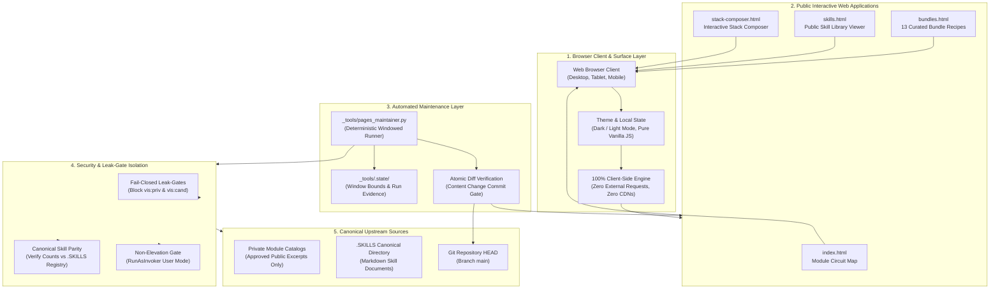
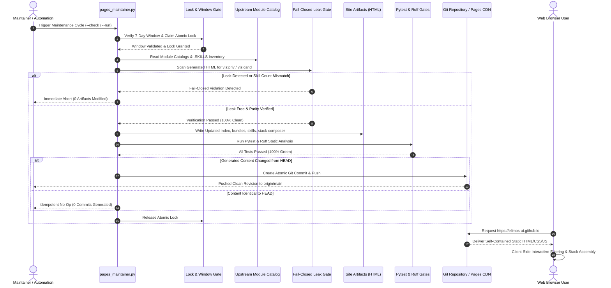

# ellmos-ai.github.io — Interactive Public Maps of the ellmos Ecosystem

**Official public web portal, interactive module circuit diagrams, bundle recipes, skill directory, and visual stack composer for the modular ellmos AI framework.**

<p align="center">
  <a href="https://github.com/ellmos-ai/ellmos-ai.github.io"></a>
  <a href="https://github.com/ellmos-ai/ellmos-ai.github.io/actions/workflows/ci.yml"></a>
  <a href="tests/"></a>
  <a href="https://www.python.org"></a>
  <a href="https://github.com/ellmos-ai/ellmos-ai.github.io"></a>
  <a href="https://ellmos-ai.github.io"></a>
  <a href="SECURITY.md"></a>
  <a href="SECURITY.md"></a>
  <a href="SECURITY.md"></a>
  <a href="https://github.com/astral-sh/ruff"></a>
  <a href="https://github.com/ellmos-ai"></a>
  <a href="https://github.com/open-bricks"></a>
  <a href="llms.txt"></a>
  <a href="https://github.com/ellmos-ai/ellmos-ai.github.io"></a>
  <a href="LICENSE"></a>
</p>

<p align="center"><strong>English</strong> · <a href="README_de.md">Deutsch</a> · <a href="https://ellmos-ai.github.io">Live Site</a></p>

> [!NOTE]
> For AI agent context, automated crawler schemas, and architectural invariants, see [`llms.txt`](llms.txt).
> All deployed web pages execute 100% offline inside the client's browser with zero external telemetry, zero tracking, and zero third-party CDNs.

---

## Quick Navigation

- [Interactive Ecosystem Showcase](#interactive-ecosystem-showcase)
- [System Architecture & Dataflow](#system-architecture--dataflow)
- [Maintenance & Publication Sequence](#maintenance--publication-sequence)
- [Pages & Features Matrix](#pages--features-matrix)
- [Governance & Runtime Invariants](#governance--runtime-invariants)
- [Pages Maintainer Automation](#pages-maintainer-automation)
- [Verification & Testing](#verification--testing)
- [Sibling Tools & Ecosystem](#sibling-tools--ecosystem)
- [Security Policy](SECURITY.md)
- [Third-Party Licenses](THIRD_PARTY_LICENSES.md)
- [Marketing Log](MARKETING-LOG.txt)
- [Changelog](CHANGELOG.md)
- [llms.txt](llms.txt)
- [License & Governance](#license--governance)

---

## Interactive Ecosystem Showcase

Live at **https://ellmos-ai.github.io**

`ellmos-ai.github.io` serves as the public graphical surface of the ellmos modular construction kit. It translates the internal module registries, composition recipes, and AI agent skills into human- and machine-readable static web experiences:

1. **Module Circuit Map** ([`index.html`](https://ellmos-ai.github.io)): Visual, categorized circuit diagram illustrating how modules (MCP servers, proxies, runners, tools) connect and exchange information.
2. **Bundle Recipes** ([`bundles.html`](https://ellmos-ai.github.io/bundles.html)): Interactive walkthrough of 13 curated deployment recipes, detailing required and optional components for specific agent profiles.
3. **Skill Library** ([`skills.html`](https://ellmos-ai.github.io/skills.html)): Searchable, live catalog of public agent skills (`SKILL.md`) with built-in viewer and clipboard integration.
4. **Stack Composer** ([`stack-composer.html`](https://ellmos-ai.github.io/stack-composer.html)): Interactive visual assembly tool enabling developers to compose valid module stacks with live rule enforcement and export to standard `stack.v2.json`.

---

## System Architecture & Dataflow



---

## Maintenance & Publication Sequence



---

## Pages & Features Matrix

| Page | File | Primary Features | Target Audience | Privacy & Execution |
|---|---|---|---|---|
| **Module Circuit Map** | [`index.html`](https://ellmos-ai.github.io) | Visual diagram of functional ecosystem clusters, module search, purpose tooltips, bilingual descriptions. | Developers, Architects, AI Agents | 100% client-side rendering, zero telemetry |
| **Bundle Recipes** | [`bundles.html`](https://ellmos-ai.github.io/bundles.html) | 13 pre-composed ecosystem recipes, component breakdown, module tiers (required / optional). | System Integrators, Teams | Pure static tables, instant offline filter |
| **Skill Library** | [`skills.html`](https://ellmos-ai.github.io/skills.html) | Direct reader for public `SKILL.md` documents, categorized listing, copy-to-clipboard markdown. | Prompt Engineers, Agents | Local DOM reader, zero external APIs |
| **Stack Composer** | [`stack-composer.html`](https://ellmos-ai.github.io/stack-composer.html) | Visual drag-and-drop stack builder, real-time compatibility rule validation, export to `stack.v2.json`. | Framework Engineers, DevOps | In-browser JSON generation & download |

---

## Governance & Runtime Invariants

The project strictly guarantees 10 operational and architectural invariants:

| Invariant ID | Guarantee | Specification & Implementation Details | Security & Operational Benefit |
|---|---|---|---|
| `INV-STATIC-01` | **100% Static & Zero Network Egress** | All deployed pages (`index.html`, `bundles.html`, `skills.html`, `stack-composer.html`) are self-contained static HTML/CSS/JavaScript documents. Zero external telemetry, zero tracking scripts, zero user analytics, and zero external third-party CDN dependencies. | Complete user confidentiality; client browsing patterns and composed stacks never leave the user's device. |
| `INV-LEAK-02` | **Fail-Closed Leak-Gates** | The maintainer suite (`_tools/pages_maintainer.py`) strictly validates public site artifacts against canonical catalogs before publication. Private module identifiers and non-public visibility markers (`vis:"priv"`, `vis:"cand"`) trigger an immediate fail-closed abort. | Absolute prevention of unintended intellectual property or internal architecture exposure. |
| `INV-CATALOG-03` | **Canonical Catalog Parity** | Skill catalog counts and module inventories must strictly match canonical `.SKILLS` and module registry definitions. Any discrepancy halts the generation process. | Guarantees public documentation remains 100% synchronized with actual framework capabilities. |
| `INV-RUNAS-04` | **Local-First & Non-Elevation (User Mode)** | All build and maintenance scripts run completely unprivileged in standard user space (`RunAsInvoker`). Administrator or root privileges are never requested, required, or assumed. | Safe, least-privilege operation preventing privilege escalation risks across developer workstations and CI runners. |
| `INV-WINDOW-05` | **Deterministic 7-Day Window Cadence** | Automated site maintenance is strictly bounded by deterministic 7-day windows anchored to Mondays, synchronized with `system-auditor` evidence runs. | Predictable maintenance intervals without uncontrolled churn or erratic micro-commits. |
| `INV-DIFF-06` | **Atomic Content-Change Commits** | Git commits are generated exclusively when verified, leak-free site content has actually changed from HEAD, preventing noisy empty commits. | Clean, meaningful commit history with zero ghost revisions or timestamp-only drift. |
| `INV-LOCK-07` | **Fail-Closed Lock Discipline** | Repository and workspace lock semantics (`LOCK.pages-maintainer.txt`, canonical LOCK rules) are enforced to ensure atomic runs and eliminate race conditions across multi-agent environments. | Zero file corruption or conflicting simultaneous generator executions across autonomous agent swarms. |
| `INV-OS-08` | **Multi-OS Platform Parity & Smoke Integrity** | Automated GitHub Actions CI workflow runs on `ubuntu-latest`, `windows-latest`, and `macos-latest` across Python 3.10-3.13 with bytecode compilation gates and Ruff linter. | Seamless cross-platform reliability for all maintainer scripts and verification fixtures. |
| `INV-CLIENT-09` | **Pure Client-Side Static Execution** | Dark/light theme toggles, circuit map filtering, bundle recipe inspection, and stack composer logic run 100% in client-side JavaScript without backend servers or server-side state. | Ultra-fast page response times, zero server infrastructure costs, and resilient offline utility. |
| `INV-SLA-10` | **48h Response & 5-Day Triage SLA** | Mandatory 48-hour response SLA for initial vulnerability acknowledgment and 5 business days for complete triage assessment. | Predictable, enterprise-grade security response and responsible vulnerability disclosure process. |

---

## Pages Maintainer Automation

The repository contains a dedicated maintenance script that couples the generated site to the `system-auditor` 7-day window. It executes generators, validates leak gates, and commits changes atomically:

```powershell
# Preflight check without making modifications
$env:PYTHONIOENCODING='utf-8'
python _tools/pages_maintainer.py --check

# Execute generation and verify site artifacts
python _tools/pages_maintainer.py --run

# Execute generation and push verified changes to origin/main
python _tools/pages_maintainer.py --run --push
```

Fallback automation instructions and scheduling hand-off guidelines are documented in [`_tools/FALLBACK-AUTOMATION.md`](_tools/FALLBACK-AUTOMATION.md).

---

## Verification & Testing

The repository enforces automated contract validation via Pytest and Ruff linting:

```powershell
# Run Ruff static code analysis
$env:PYTHONIOENCODING='utf-8'
python -m ruff check .

# Verify Python bytecode integrity
python -m compileall -q _tools tests

# Execute complete automated test suite
python -m pytest -ra -v
```

Verification covers:
- CI workflow configuration and multi-OS matrix
- PEP 621 metadata completeness and URLs
- Bilingual security policy and 48h/5d SLA commitments
- Static site artifact existence and size checks
- Leak-gate invariant enforcement against private markers
- Bilingual README and anchor parity
- LLM reference integrity (`llms.txt`)
- Multi-host sync conflict and lockfile `.gitignore` rules

---

## Sibling Tools & Ecosystem

`ellmos-ai.github.io` visually surfaces and interconnects the broader tooling ecosystem across `ellmos-ai`, `dev-bricks`, `file-bricks`, `doc-bricks`, and `open-bricks`:

| Tool | Repository | Focus & Role in Ecosystem |
|---|---|---|
| **coma** | [ellmos-ai/coma](https://github.com/ellmos-ai/coma) | Multi-Agent Job Board & Provider Routing Bridge |
| **clutch** | [ellmos-ai/clutch](https://github.com/ellmos-ai/clutch) | Provider-neutral routing for single tasks |
| **MarbleRun** | [ellmos-ai/MarbleRun](https://github.com/ellmos-ai/MarbleRun) | Sequential agent loops & chain execution |
| **policy-registry** | [ellmos-ai/policy-registry](https://github.com/ellmos-ai/policy-registry) | Policy governance & capability permission authority |
| **system-explorer** | [ellmos-ai/system-explorer](https://github.com/ellmos-ai/system-explorer) | System-wide topology & stack inspection |
| **sqlite-transit-sync** | [ellmos-ai/sqlite-transit-sync](https://github.com/ellmos-ai/sqlite-transit-sync) | Secure SQLite snapshot & sync pipeline |
| **workflowhooker** | [ellmos-ai/workflowhooker](https://github.com/ellmos-ai/workflowhooker) | Workflow hooking & lifecycle event interceptor |
| **memoryhooker** | [ellmos-ai/memoryhooker](https://github.com/ellmos-ai/memoryhooker) | Agent memory injection & provenance tracking |
| **swarm_ai** | [ellmos-ai/swarm_ai](https://github.com/ellmos-ai/swarm_ai) | LLM swarm intelligence & consensus voting toolkit |
| **ellmos-filecommander-mcp** | [ellmos-ai/ellmos-filecommander-mcp](https://github.com/ellmos-ai/ellmos-filecommander-mcp) | Local-First FileCommander MCP Server |
| **ellmos-codecommander-mcp** | [ellmos-ai/ellmos-codecommander-mcp](https://github.com/ellmos-ai/ellmos-codecommander-mcp) | Local-First CodeCommander MCP Server |
| **ellmos-controlcenter-mcp** | [ellmos-ai/ellmos-controlcenter-mcp](https://github.com/ellmos-ai/ellmos-controlcenter-mcp) | Unified AI Tools & Profiles Control Center MCP |
| **DevCenter** | [dev-bricks/DevCenter](https://github.com/dev-bricks/DevCenter) | Developer workstation hub & process control |
| **CodeBox** | [dev-bricks/CodeBox](https://github.com/dev-bricks/CodeBox) | Multi-language code runner & plugin platform |
| **ProFiler** | [file-bricks/ProFiler](https://github.com/file-bricks/ProFiler) | Local-First file analysis & privacy traffic light |
| **open-bricks** | [open-bricks/open-bricks](https://github.com/open-bricks) | Umbrella open-source developer tooling ecosystem |

---

## Security & Privacy SLA

`ellmos-ai.github.io` guarantees 100% zero-egress static execution. For full security disclosures, vulnerability reporting procedures, supported versions, and our binding 48-hour response / 5-day triage SLA, please refer to [`SECURITY.md`](SECURITY.md).

---

## License & Governance

Distributed under the terms of the **MIT License** — see [LICENSE](LICENSE) for details.
Third-party component disclosures and permissive licensing notices are documented in [THIRD_PARTY_LICENSES.md](THIRD_PARTY_LICENSES.md).
Project marketing, keywords, and discoverability records are maintained in [MARKETING-LOG.txt](MARKETING-LOG.txt).
