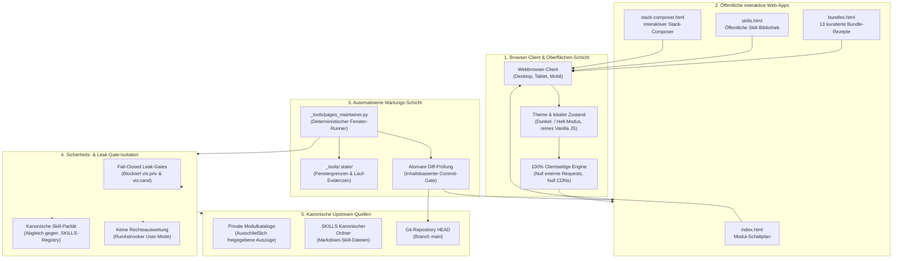
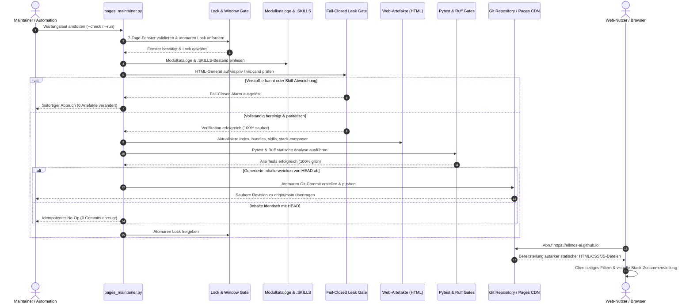

# ellmos-ai.github.io — Interaktive Karten des ellmos-Ökosystems

**Offizielles öffentliches Webportal, interaktive Modul-Schaltpläne, Bundle-Rezepte, Skill-Bibliothek und visueller Stack-Composer für das modulare ellmos KI-Framework.**

<p align="center">
  <a href="https://github.com/ellmos-ai/ellmos-ai.github.io"></a>
  <a href="https://github.com/ellmos-ai/ellmos-ai.github.io/actions/workflows/ci.yml"></a>
  <a href="tests/"></a>
  <a href="https://www.python.org"></a>
  <a href="https://github.com/ellmos-ai/ellmos-ai.github.io"></a>
  <a href="https://ellmos-ai.github.io"></a>
  <a href="SECURITY.md"></a>
  <a href="SECURITY.md"></a>
  <a href="SECURITY.md"></a>
  <a href="https://github.com/astral-sh/ruff"></a>
  <a href="https://github.com/ellmos-ai"></a>
  <a href="https://github.com/open-bricks"></a>
  <a href="llms.txt"></a>
  <a href="https://github.com/ellmos-ai/ellmos-ai.github.io"></a>
  <a href="LICENSE"></a>
</p>

<p align="center"><a href="README.md">English</a> · <strong>Deutsch</strong> · <a href="https://ellmos-ai.github.io">Live-Portal</a></p>

> [!NOTE]
> Für KI-Agenten-Kontext, maschinenlesbare Schemata und architektonische Invarianten siehe [`llms.txt`](llms.txt).
> Alle bereitgestellten Webseiten laufen zu 100% offline im Browser des Nutzers – ohne externe Telemetrie, ohne Tracking und ohne Drittanbieter-CDNs.

---

## Schnellnavigation

- [1. Funktionen & Kernfähigkeiten](#1-funktionen)
- [2. Systemarchitektur & Topologie](#2-architektur)
- [3. Zielgruppen-Personas & Auffindbarkeit](#3-zielgruppen-personas--auffindbarkeit)
- [4. Vergleichsmatrix vs. Alternativen](#4-vergleichsmatrix-vs-alternativen)
- [5. Duale Mermaid-Diagramme](#5-duale-mermaid-diagramme)
- [6. Governance- & Laufzeit-Invarianten](#6-governance--laufzeit-invarianten)
- [7. Interaktive Web-Anwendungs-Matrix](#7-interaktive-web-anwendungs-matrix)
- [8. Modul-Schaltplan Deep Dive](#8-modul-schaltplan-deep-dive)
- [9. Kuratierte Bundle-Rezepte](#9-kuratierte-bundle-rezepte)
- [10. Öffentlicher Skill-Library-Viewer](#10-oeffentlicher-skill-library-viewer)
- [11. Interaktiver Stack-Composer-Canvas](#11-interaktiver-stack-composer-canvas)
- [12. Pages-Maintainer-Automation & Leak-Gates](#12-pages-maintainer-automation--leak-gates)
- [13. Verifikation, Tests & Qualitäts-Gates](#13-verifikation-tests--qualitaets-gates)
- [14. Geschwister-Ökosystem & Cross-Projekt-Topologie](#14-geschwister-oekosystem--cross-projekt-topologie)
- [15. Drittanbieter-Lizenzen & Open-Source-Auditierung](#15-drittanbieter-lizenzen--open-source-auditierung)
- [16. Maschinenlesbarer LLM-Kontext & Agenten-Protokoll](#16-maschinenlesbarer-llm-kontext--agenten-protokoll)
- [17. Änderungsprotokoll & Projekt-Historie](#17-aenderungsprotokoll--projekt-historie)
- [18. Sicherheitsrichtlinie & Gesetzlicher Hinweis](#18-sicherheitsrichtlinie--gesetzlicher-hinweis)

---

<a id="1-features"></a>
<a id="features"></a>
<a id="key-features"></a>
<a id="1-funktionen"></a>
<a id="funktionen"></a>
<a id="hauptfunktionen"></a>
## 1. Funktionen & Kernfähigkeiten

Live erreichbar unter **https://ellmos-ai.github.io**

`ellmos-ai.github.io` dient als öffentliche visuelle Oberfläche des modularen ellmos-Baukastens. Es überführt interne Modulregister, Kompositionsrezepte und KI-Agenten-Skills in benutzer- und maschinenlesbare statische Weboberflächen:

1. **Modul-Schaltplan** ([`index.html`](https://ellmos-ai.github.io)): Visuelles, domänenspezifisch gegliedertes Schaltbild, das Interaktionen und Protokolle zwischen Modulen (MCP-Server, Proxys, Runner, Werkzeuge) darstellt.
2. **Bundle-Rezepte** ([`bundles.html`](https://ellmos-ai.github.io/bundles.html)): Interaktive Übersicht über 13 kuratierte Bereitstellungsrezepte mit klaren Pflicht- und Optionskomponenten für spezifische Agentenprofile.
3. **Skill-Bibliothek** ([`skills.html`](https://ellmos-ai.github.io/skills.html)): Durchsuchbarer Katalog aller öffentlichen Agenten-Skills (`SKILL.md`) mit integriertem Betrachter und Zwischenablage-Funktion.
4. **Stack-Composer** ([`stack-composer.html`](https://ellmos-ai.github.io/stack-composer.html)): Interaktive visuelle Arbeitsfläche zur Zusammenstellung valider Modul-Stacks mit Live-Regelprüfung und Export nach `stack.v2.json`.
5. **Zero-Egress Datenschutz**: Reine Ausführung in HTML5/CSS3/Vanilla JS im Browser des Nutzers ohne externe Netzwerkanfragen und ohne Drittanbieter-CDNs.
6. **Bilinguale Navigationsparität**: Vollständig symmetrische Struktur und reziproke HTML-Anker-Aliasse zwischen Deutsch und Englisch.

---

<a id="2-architecture"></a>
<a id="architecture"></a>
<a id="system-architecture"></a>
<a id="system-architecture--dataflow"></a>
<a id="2-architektur"></a>
<a id="architektur"></a>
<a id="systemarchitektur"></a>
<a id="systemarchitektur--datenfluss"></a>
## 2. Systemarchitektur & Topologie

Die Bereitstellungsarchitektur von `ellmos-ai.github.io` verbindet lokale Entwicklungs-Repositories, kanonische Skill-Kataloge, automatisierte Leak-Gates und die GitHub-Pages-CDN-Bereitstellung:

- **Oberflächen-Schicht (Browser-Client)**: Rendert das statische DOM, übernimmt clientseitiges Filtern, Theme-Umschaltung (Dunkel/Hell) und Stack-Komposition vollständig im lokalen Arbeitsspeicher.
- **Artefakt-Schicht (Statische Web-Anwendungen)**: In sich geschlossene HTML/CSS/JS-Pakete (`index.html`, `bundles.html`, `skills.html`, `stack-composer.html`, `.nojekyll`) ohne jeglichen serverseitigen Zustand.
- **Wartungs-Schicht (`_tools/pages_maintainer.py`)**: Deterministischer Runner auf Basis rollierender 7-Tage-Fenster (montags verankert), der Skill-Parität prüft und Fail-Closed Leak-Gates erzwingt.
- **Sicherheits-Isolationsschicht**: Stellt sicher, dass keine Entwurfs- oder internen Module (`vis:"priv"`, `vis:"cand"`) in öffentliche Artefakte gelangen.
- **Kanonische Upstream-Quellen**: Bezieht ausschließlich freigegebene Auszüge aus `.SKILLS`-Registern und Modulkonfigurationsschemata.

---

<a id="3-target-personas--discoverability"></a>
<a id="target-personas"></a>
<a id="discoverability"></a>
<a id="3-zielgruppen-personas--auffindbarkeit"></a>
<a id="zielgruppen-personas"></a>
<a id="auffindbarkeit"></a>
## 3. Zielgruppen-Personas & Auffindbarkeit

`ellmos-ai.github.io` wurde gezielt entwickelt, um konkrete Arbeitsabläufe für vier Kernzielgruppen zu optimieren:

### `[PERSONA-01]` Autonome KI-Agenten-Architekten & Operatoren
- **Rolle**: KI-Infrastruktur-Ingenieure, Multi-Agenten-Schwarm-Entwickler (Gemini, Claude Code, Codex).
- **Kernproblem**: Fragmentierte, veraltete Agenten-Skill-Register und Fehlen standardisierter JSON-Stack-Deklarationen für autonome Worker.
- **Lösung**: Zentralisierte, maschinenlesbare [`llms.txt`](llms.txt), validierter `SKILL.md`-Bibliotheksbetrachter und exportierbare `stack.v2.json`-Schemadefinitionen.
- **Typischer Ablauf**: `llms.txt` einlesen -> `skills.html` nach Domänenfähigkeiten durchsuchen -> Stack in `stack-composer.html` zusammenstellen -> `stack.v2.json` exportieren -> an Agenten-Runner übergeben.
- **Hochrelevante Suchbegriffe**:
  * *"modularer KI-Agenten Stack Composer"*
  * *"maschinenlesbare Agenten Skills Bibliothek"*
  * *"MCP Server Ökosystem interaktive Karte"*
  * *"standardisiertes Agenten Rezept stack.v2.json"*

### `[PERSONA-02]` Modulare System-Ingenieure & Entwickler
- **Rolle**: Backend- und Tooling-Entwickler, die entkoppelte KI-Erweiterungen und MCP-Server erstellen.
- **Kernproblem**: Fehlende visuelle Übersicht darüber, wie isolierte Werkzeuge, Proxys und Runner in der Agenten-Laufzeit zusammenwirken.
- **Lösung**: Visueller Modul-Schaltplan mit Domänen-Clustern, Port-Definitionen und transparenter Baustein-Klassifizierung.
- **Typischer Ablauf**: `index.html` öffnen -> nach Funktionscluster (z. B. Code & Development) filtern -> Modul-Tooltips prüfen -> Kompatibilität sicherstellen.
- **Hochrelevante Suchbegriffe**:
  * *"visuelles MCP Server Abhängigkeitsdiagramm"*
  * *"modulare KI Werkzeuge Schaltplan"*
  * *"open-bricks Agenten Architektur Übersicht"*
  * *"Local-First KI Agenten Modulregister"*

### `[PERSONA-03]` Prompt-Engineers & KI-Workflow-Designer
- **Rolle**: Prompt-Engineers, KI-Teamleiter und Fachspezialisten für maßgeschneiderte Agenten-Instruktionen.
- **Kernproblem**: Zeitaufwendiges manuelles Durchsuchen von Git-Repositories nach konformen, sofort einsetzbaren Systemanweisungen.
- **Lösung**: Interaktive `skills.html` mit Volltextsuche, Kategoriereitern, gerendertem Markdown-Vorschaufenster und 1-Klick-Kopierfunktion.
- **Typischer Ablauf**: `skills.html` aufrufen -> Kategorie wählen -> Markdown prüfen -> auf *Copy Markdown* klicken -> in System-Prompt einfügen.
- **Hochrelevante Suchbegriffe**:
  * *"Agenten Skill Bibliothek Markdown Browser"*
  * *"kuratierte System Prompt Bundle Rezepte"*
  * *"Offline KI Agenten Skill Katalog"*
  * *"SKILL.md Vorlagen Verzeichnis kopieren"*

### `[PERSONA-04]` Sicherheits- & Compliance-Beauftragte
- **Rolle**: IT-Sicherheitsprüfer, Datenschutzbeauftragte und Compliance-Architekten für Unternehmensumgebungen.
- **Kernproblem**: Cloudbasierte SaaS-Tools leiten Geschäftsgeheimnisse, Nutzerverhalten oder Architektur-Blueprints an externe Server weiter.
- **Lösung**: 100% Zero-Egress-Garantie (`INV-STATIC-01`), reine clientseitige DOM-Verarbeitung, Fail-Closed Leak-Gates (`INV-LEAK-02`) und unprivilegierte Ausführung (`INV-RUNAS-04`).
- **Typischer Ablauf**: [`SECURITY.md`](SECURITY.md) und [`THIRD_PARTY_LICENSES.md`](THIRD_PARTY_LICENSES.md) einsehen -> Netzwerktab in DevTools prüfen -> 0 externe Anfragen verifizieren.
- **Hochrelevante Suchbegriffe**:
  * *"Zero Egress statische Agenten Architektur Visualisierung"*
  * *"datenschutzkonforme Local First KI Dokumentation"*
  * *"Fail-Closed Leak-Gate statischer Website Generator"*
  * *"Air-Gapped kompatibler KI Werkzeug Katalog"*

---

<a id="4-comparative-matrix-vs-alternatives"></a>
<a id="comparative-matrix"></a>
<a id="4-vergleichsmatrix-vs-alternativen"></a>
<a id="vergleichsmatrix"></a>
## 4. Vergleichsmatrix vs. Alternativen

Die folgende Matrix stellt `ellmos-ai.github.io` alternativen Dokumentations- und Modell-Hub-Konzepten entlang von 10 Laufzeit-Invarianten gegenüber:

| Vergleichsdimension | Laufzeit-Invariante | `ellmos-ai.github.io` | Cloud-API & Agenten-Hubs (z. B. HuggingFace, LangSmith) | Statische Doku-Generatoren (z. B. Docusaurus, MkDocs) | Schwere dynamische SPAs (z. B. Next.js auf Vercel) | Unstrukturierte GitHub-README-Sammlungen |
|---|---|---|---|---|---|---|
| **1. Netzwerk-Egress & Telemetrie** | `INV-STATIC-01` | **100% Zero-Egress** (0 CDNs, 0 Analytics, 0 Cookies) | Umfangreiches Tracking, Cookies, externe Telemetrie | Häufig integriertes Google Analytics, Webfonts, CDNs | Dynamische API-Routen, Server-Logs, Cookies | Minimal, jedoch ohne jegliche interaktive Werkzeuge |
| **2. Leak-Prävention & Sichtbarkeits-Gates** | `INV-LEAK-02` | **Fail-Closed Leak-Gates** (strikter `vis:priv`/`vis:cand`-Filter) | Manuelle Veröffentlichung oder Public-by-Default-Gefahr | Keine integrierten Leak-Gates; rein manuelle Ausschlüsse | Abhängig von komplexen Backend-ACLs und Middleware | Hohes Risiko versehentlicher Commits privater Entwürfe |
| **3. Katalog- & Skill-Synchronisation** | `INV-CATALOG-03` | **Exakte kanonische Parität** (Abgleich mit `.SKILLS`) | Cloud-Datenbank driftet gegen lokale Dateien | Statische Markdown-Drift ohne manuelle Neuerstellung | Datenbank-Sync-Verzögerung oder tote API-Stubs | Häufige Desynchronisation und verwaiste Links |
| **4. Ausführungs-Rechteebene** | `INV-RUNAS-04` | **Unprivilegierter User-Mode** (`RunAsInvoker`, 0 Admin-Rechte) | Root in Cloud-Containern / privilegierte Server | Standard-CLI, benötigt jedoch oft globale npm-Pakete | Erfordert Node.js-Serverprozesse und Root-Container | Keine (reine Git-Dateien) |
| **5. Wartungs-Kadenz** | `INV-WINDOW-05` | **Deterministisches 7-Tage-Fenster** (montags verankert) | Unkoordinierte Ad-hoc-Rebuilds bei jedem Trigger | Manuelle Rebuilds bei jedem Korrekturlauf | Automatisierte CI/CD-Webhooks mit ständigen Deploys | Unregelmäßige, ungetrackte manuelle Änderungen |
| **6. Atomare Git-Historie** | `INV-DIFF-06` | **Atomare Content-Commits** (nur bei echten Textänderungen) | Intransparente Datenbank-Revisionen | Leere Commits oder Zeitstempel-Rauschen häufig | Hohe Zahl automatischer Deployment-Commits | Hohes Grundrauschen unwesentlicher Doku-Commits |
| **7. Multi-Agenten-Nebenläufigkeit** | `INV-LOCK-07` | **Fail-Closed Lock-Protokoll** (`LOCK.pages-maintainer.txt`) | Datenbank-Zeilensperren oder Optimistic Locking | Keinerlei Schutz vor konkurrierenden lokalen Läufen | Verteilte Redis-Locks oder Datenbank-Sperren | Hohe Merge-Konflikt-Gefahr in Agenten-Schwärmen |
| **8. Multi-OS CI-Validierung** | `INV-OS-08` | **Dreifach-OS-Matrix** (Ubuntu, Windows, macOS; Py 3.10-3.13) | Meist reine Linux-Cloud-Container-Builds | Oft nur auf einem einzigen Betriebssystem getestet | Typisch auf Linux-Runnern getestet | In der Regel ohne automatisierte Tests |
| **9. Offline-Client-Autonomie** | `INV-CLIENT-09` | **100% Reines Client-Side JS** (voll offlinefähig) | Bricht ohne Internetverbindung vollständig ab | Offline lesbar, Suche benötigt jedoch oft Server-Index | Funktioniert nicht ohne aktiven Backend-Server | Offline lesbar, aber ohne interaktive Logik |
| **10. Sicherheits- & Triage-SLA** | `INV-SLA-10` | **Verbindliche 48h-Antwort / 5-Tage-Triage** (SECURITY.md) | Standard-Enterprise-Ticket-Queues oder Best-Effort | Open-Source Best-Effort ohne formelle Zusagen | Plattform-Provider-SLA, nicht repospezifisch | Keine definierten Sicherheitszusagen |

---

<a id="5-dual-mermaid-diagrams"></a>
<a id="diagrams"></a>
<a id="mermaid-diagrams"></a>
<a id="5-duale-mermaid-diagramme"></a>
<a id="duale-diagramme"></a>
<a id="mermaid-diagramme"></a>
## 5. Duale Mermaid-Diagramme

### Architektur-Topologie-Diagramm



### Wartungs- & Publikations-Sequenzdiagramm



---

<a id="6-governance--runtime-invariants"></a>
<a id="invariants"></a>
<a id="governance"></a>
<a id="6-governance--laufzeitinvarianten"></a>
<a id="laufzeitinvarianten"></a>
## 6. Governance- & Laufzeit-Invarianten

Das Projekt garantiert verbindlich 10 betriebliche und architektonische Invarianten:

| Invarianten-ID | Zusage | Spezifikation & Implementierungsdetails | Sicherheits- & Betriebsvorteil |
|---|---|---|---|
| `INV-STATIC-01` | **100% Statisch & Zero Network Egress** | Alle bereitgestellten Seiten (`index.html`, `bundles.html`, `skills.html`, `stack-composer.html`) sind autarke statische Dokumente. Null externe Telemetrie, keine Tracking-Skripte, keine Web-Analytics und keine externen CDNs. | Vollständige Vertraulichkeit; Nutzerverhalten und zusammengestellte Stacks verlassen das Gerät des Anwenders niemals. |
| `INV-LEAK-02` | **Fail-Closed Leak-Gates** | Die Maintainer-Suite (`_tools/pages_maintainer.py`) prüft öffentliche Artefakte vor Veröffentlichung gegen interne Kataloge. Private Modul-IDs oder Entwurfs-Marker (`vis:"priv"`, `vis:"cand"`) führen zum sofortigen Abbruch. | Zuverlässiger Schutz vor unbeabsichtigter Veröffentlichung interner Architekturdetails oder geistigen Eigentums. |
| `INV-CATALOG-03` | **Kanonische Katalog-Parität** | Anzahl und IDs der exportierten Skills müssen exakt mit dem kanonischen `.SKILLS`-Bestand übereinstimmen. Jede Abweichung stoppt den Veröffentlichungsprozess. | Garantiert, dass die öffentliche Dokumentation immer exakt den tatsächlichen Fähigkeiten des Frameworks entspricht. |
| `INV-RUNAS-04` | **Local-First & Non-Elevation (User-Mode)** | Alle Build- und Wartungsskripte laufen uneingeschränkt im Standard-Benutzerkontext (`RunAsInvoker`). Administrator- oder Root-Rechte werden weder angefordert noch benötigt. | Sicherer Betrieb nach dem Least-Privilege-Prinzip ohne Eskalationsrisiken auf Entwickler-Workstations und CI-Runnern. |
| `INV-WINDOW-05` | **Deterministische 7-Tage-Fenster** | Automatisierte Aktualisierungen sind fest an deterministische 7-Tage-Fenster mit Montagsanker gekoppelt, synchronisiert mit `system-auditor`. | Planbare Wartungsintervalle ohne unkontrolliertes Rauschen oder hektische Mikroveröffentlichungen. |
| `INV-DIFF-06` | **Atomare Content-Commits** | Git-Commits werden ausschließlich erzeugt, wenn geprüfte, leak-freie Web-Artefakte tatsächlich von HEAD abweichen. | Saubere, aussagekräftige Git-Historie ohne leere Commits oder Zeitstempel-Drift. |
| `INV-LOCK-07` | **Fail-Closed Lock-Disziplin** | Repository- und Workspace-Sperren (`LOCK.pages-maintainer.txt`, kanonische LOCK-Regeln) verhindern Datenkorruption und Race Conditions in Multi-Agenten-Umgebungen. | Vollständiger Schutz vor Dateibeschädigungen bei parallelen Läufen autonomer Agenten-Schwärme. |
| `INV-OS-08` | **Multi-OS Plattform-Parität & Smoke-Integrität** | Automatisierte GitHub Actions CI läuft auf `ubuntu-latest`, `windows-latest` und `macos-latest` unter Python 3.10-3.13 mit Bytecode- und Ruff-Prüfung. | Plattformübergreifende Zuverlässigkeit für alle Werkzeuge, Skripte und Verifikationstests. |
| `INV-CLIENT-09` | **Reine clientseitige statische Ausführung** | Theme-Wechsel, Modulsuche, Bundle-Prüfung und Stack-Zusammenstellung erfolgen vollständig über lokales JavaScript ohne Server-Dependencies. | Maximale Reaktionsgeschwindigkeit, Ausfallsicherheit ohne Serverkosten und vollständige Offline-Nutzbarkeit. |
| `INV-SLA-10` | **48h-Antwort & 5-Tage-Triage-SLA** | Verbindliche 48-Stunden-Frist zur Bestätigung von Sicherheitsmeldungen und maximal 5 Werktage für die vollständige Ersteinschätzung. | Professioneller, verlässlicher Sicherheitsprozess und strukturierte Behebung gemeldeter Schwachstellen. |

---

<a id="7-interactive-web-applications-matrix"></a>
<a id="pages--features-matrix"></a>
<a id="pages-matrix"></a>
<a id="7-interaktive-web-anwendungs-matrix"></a>
<a id="web-anwendungs-matrix"></a>
## 7. Interaktive Web-Anwendungs-Matrix

| Seite | Datei | Kernfunktionen | Zielgruppe | Datenschutz & Ausführung |
|---|---|---|---|---|
| **Modul-Schaltplan** | [`index.html`](https://ellmos-ai.github.io) | Visuelle Cluster-Übersicht, Modulsuche, Tooltips, bilinguale Beschreibungen. | Entwickler, Architekten, KI-Agenten | 100% clientseitiges Rendering, 0 Telemetrie |
| **Bundle-Rezepte** | [`bundles.html`](https://ellmos-ai.github.io/bundles.html) | 13 vorkomponierte Rezepte, Komponentenzerlegung, Einstufung (Pflicht / Option). | System-Integratoren, Teams | Reine statische Tabellen, sofortige Offline-Filterung |
| **Skill-Bibliothek** | [`skills.html`](https://ellmos-ai.github.io/skills.html) | Direktansicht für öffentliche `SKILL.md`-Dateien, Kategorien, Markdown-Kopierfunktion. | Prompt-Engineers, Agenten | Lokaler DOM-Reader, null externe APIs |
| **Stack-Composer** | [`stack-composer.html`](https://ellmos-ai.github.io/stack-composer.html) | Visueller Drag-and-Drop Stack-Builder, Live-Regelprüfung, Export nach `stack.v2.json`. | Framework-Ingenieure, DevOps | Im Browser generierter Download |

---

<a id="8-module-circuit-map-deep-dive"></a>
<a id="module-circuit-map"></a>
<a id="8-modul-schaltplan-deep-dive"></a>
<a id="modul-schaltplan"></a>
## 8. Modul-Schaltplan Deep Dive

Der **Modul-Schaltplan** ([`index.html`](https://ellmos-ai.github.io)) bietet eine umfassende architektonische Gesamtübersicht:

- **Interaktive Kategorisierung**: Gruppiert Module in Infrastruktur, Proxys & Routing, Ausführungs-Engines, Entwickler-Werkzeuge und Daten-Transit.
- **Port-Kompatibilität**: Visualisiert Datenpfade zwischen Client-Werkzeugen und MCP-Servern.
- **Echtzeit-Suche & Filter**: Sofortige Filterung nach Modulname, Stichwort oder Sprache ohne Server-Roundtrips.
- **Theme-Erhalt**: Dunkel- und Hell-Modus gesteuert über pure CSS-Variablen ohne Tracking-Cookies.

---

<a id="9-curated-bundle-recipes"></a>
<a id="bundle-recipes"></a>
<a id="9-kuratierte-bundle-rezepte"></a>
<a id="kuratierte-rezepte"></a>
## 9. Kuratierte Bundle-Rezepte

Die Seite **Bundle-Rezepte** ([`bundles.html`](https://ellmos-ai.github.io/bundles.html)) dokumentiert 13 praxiserprobte Kompositionsmuster:

- **Komponenten-Schichten**: Unterscheidet zwischen essenziellen Basiskomponenten und domänenspezifischen Erweiterungen.
- **Rezept-Katalog**: Rezepte für Autonomes Coden, Deep Research, Dokumentations-Auditierung und Daten-Synchronisation.
- **Deterministische Stacks**: Garantiert reproduzierbare, konfliktfreie Setups über verschiedene Agenten-Runtimes hinweg.

---

<a id="10-public-skill-library-viewer"></a>
<a id="skill-library"></a>
<a id="10-oeffentlicher-skill-library-viewer"></a>
<a id="skill-bibliothek"></a>
## 10. Öffentlicher Skill-Library-Viewer

Die **Skill-Bibliothek** ([`skills.html`](https://ellmos-ai.github.io/skills.html)) macht öffentliche Agenten-Fähigkeiten zugänglich:

- **Kategorisierter Index**: Gliedert Skills in Entwicklung, Infrastruktur, Dienstprogramme, Forschung und Bildung.
- **Integrierter Markdown-Renderer**: Zeigt vollständige `SKILL.md`-Instruktionen direkt und leserfreundlich im Browser an.
- **Zwischenablage-Funktion**: 1-Klick-Aktion zum Kopieren des Roh-Markdowns direkt in Agenten-Prompts.

---

<a id="11-interactive-stack-composer-canvas"></a>
<a id="stack-composer"></a>
<a id="11-interaktiver-stack-composer-canvas"></a>
<a id="stack-composer-canvas"></a>
## 11. Interaktiver Stack-Composer-Canvas

Der **Stack-Composer** ([`stack-composer.html`](https://ellmos-ai.github.io/stack-composer.html)) ermöglicht die intuitive Konfiguration von Agenten-Umgebungen:

- **Visuelle Zusammenstellung**: Drag-and-Drop-Arbeitsfläche zum Hinzufügen, Entfernen und Verknüpfen von Modulen.
- **Echtzeit-Validierung**: Live-Regelprüfung verhindert ungültige oder widersprüchliche Modulkombinationen.
- **Standardisierter Export**: Erzeugt valide `stack.v2.json`-Dateien für Agenten-Runner und lokale Hintergrunddienste.

---

<a id="12-pages-maintainer-automation--leak-gates"></a>
<a id="pages-maintainer-automation"></a>
<a id="12-pages-maintainer-automation--leak-gates"></a>
<a id="maintainer-automation"></a>
## 12. Pages-Maintainer-Automation & Leak-Gates

Das Repository enthält ein dediziertes Wartungswerkzeug (`_tools/pages_maintainer.py`), das Leak-Gates und atomare Commits steuert:

```powershell
# Vorabprüfung ohne Dateiänderungen
$env:PYTHONIOENCODING='utf-8'
python _tools/pages_maintainer.py --check

# Artefakte generieren und prüfen
python _tools/pages_maintainer.py --run

# Artefakte generieren und nach origin/main pushen
python _tools/pages_maintainer.py --run --push
```

Detaillierte Handlungsanweisungen und Fallback-Dokumentation finden sich in [`_tools/FALLBACK-AUTOMATION.md`](_tools/FALLBACK-AUTOMATION.md).

---

<a id="13-verification-testing--quality-gates"></a>
<a id="verification--testing"></a>
<a id="13-verifikation-tests--qualitaets-gates"></a>
<a id="verifikation--tests"></a>
## 13. Verifikation, Tests & Qualitäts-Gates

Die Codebasis unterliegt automatisierter Qualitätsprüfung mittels Pytest und Ruff:

```powershell
# Ruff statische Code-Analyse
$env:PYTHONIOENCODING='utf-8'
python -m ruff check .

# Python Bytecode-Integrität prüfen
python -m compileall -q _tools tests

# Vollständige automatisierte Testsuite ausführen
python -m pytest -ra -v
```

Die Verifikation umfasst:
- CI-Workflow-Konfiguration und Multi-OS-Matrix (`INV-OS-08`)
- PEP 621 Metadaten-Vollständigkeit und Projekt-URLs
- Symmetrische 18-Punkte-Navigationsparität und reziproke HTML-Anker
- Zielgruppen-Personas `[PERSONA-01]` bis `[PERSONA-04]` und Vergleichsmatrix
- Existenz statischer Web-Artefakte und Leak-Gate-Durchsetzung (`INV-LEAK-02`)
- Integrität der Lizenzangaben (`THIRD_PARTY_LICENSES.md`)
- LLM-Referenz-Integrität (`llms.txt`) und Änderungsprotokoll-Abgleich

---

<a id="14-sibling-ecosystem--cross-project-topology"></a>
<a id="sibling-tools--ecosystem"></a>
<a id="sibling-tools"></a>
<a id="14-geschwister-oekosystem--cross-projekt-topologie"></a>
<a id="geschwister-oekosystem"></a>
## 14. Geschwister-Ökosystem & Cross-Projekt-Topologie

`ellmos-ai.github.io` verknüpft und visualisiert das übergreifende Ökosystem aus `ellmos-ai`, `dev-bricks`, `file-bricks`, `doc-bricks` und `open-bricks`:

| Werkzeug | Repository | Rolle & Fokus im Ökosystem |
|---|---|---|
| **coma** | [ellmos-ai/coma](https://github.com/ellmos-ai/coma) | Multi-Agent Job Board & Provider Routing Bridge |
| **clutch** | [ellmos-ai/clutch](https://github.com/ellmos-ai/clutch) | Provider-neutrales Routing für Einzelaufgaben |
| **MarbleRun** | [ellmos-ai/MarbleRun](https://github.com/ellmos-ai/MarbleRun) | Sequenzielle Agenten-Schleifen & Kettenausführung |
| **policy-registry** | [ellmos-ai/policy-registry](https://github.com/ellmos-ai/policy-registry) | Policy-Governance & Rechte-Autorität |
| **system-explorer** | [ellmos-ai/system-explorer](https://github.com/ellmos-ai/system-explorer) | Systemweite Topologie- & Stack-Inspektion |
| **sqlite-transit-sync** | [ellmos-ai/sqlite-transit-sync](https://github.com/ellmos-ai/sqlite-transit-sync) | Sichere SQLite-Snapshot- & Sync-Pipeline |
| **workflowhooker** | [ellmos-ai/workflowhooker](https://github.com/ellmos-ai/workflowhooker) | Workflow-Hooking & Ereignis-Interceptor |
| **memoryhooker** | [ellmos-ai/memoryhooker](https://github.com/ellmos-ai/memoryhooker) | Agenten-Gedächtnis & Provenienz-Tracking |
| **swarm_ai** | [ellmos-ai/swarm_ai](https://github.com/ellmos-ai/swarm_ai) | LLM-Schwarmintelligenz & Konsens-Voting |
| **ellmos-filecommander-mcp** | [ellmos-ai/ellmos-filecommander-mcp](https://github.com/ellmos-ai/ellmos-filecommander-mcp) | Local-First FileCommander MCP Server |
| **ellmos-codecommander-mcp** | [ellmos-ai/ellmos-codecommander-mcp](https://github.com/ellmos-ai/ellmos-codecommander-mcp) | Local-First CodeCommander MCP Server |
| **ellmos-controlcenter-mcp** | [ellmos-ai/ellmos-controlcenter-mcp](https://github.com/ellmos-ai/ellmos-controlcenter-mcp) | Unified AI Tools & Profiles Control Center MCP |
| **DevCenter** | [dev-bricks/DevCenter](https://github.com/dev-bricks/DevCenter) | Entwickler-Workstation Hub & Prozesssteuerung |
| **CodeBox** | [dev-bricks/CodeBox](https://github.com/dev-bricks/CodeBox) | Multi-Language Code Runner & Plugin-Plattform |
| **ProFiler** | [file-bricks/ProFiler](https://github.com/file-bricks/ProFiler) | Local-First Dateianalyse & Datenschutz-Ampel |
| **open-bricks** | [open-bricks/open-bricks](https://github.com/open-bricks) | Dachorganisation für modulare Entwicklerwerkzeuge |

---

<a id="15-third-party-licenses--open-source-auditing"></a>
<a id="third-party-licenses"></a>
<a id="15-drittanbieter-lizenzen--open-source-auditierung"></a>
<a id="drittanbieter-lizenzen"></a>
## 15. Drittanbieter-Lizenzen & Open-Source-Auditierung

Die Web-Anwendungen in `ellmos-ai.github.io` basieren zu 100% auf nativem HTML5, modernem CSS und Vanilla JavaScript **ohne externe Laufzeitabhängigkeiten**. Alle Entwicklungs- und Wartungswerkzeuge sind permissiv lizenziert:
- **Python Standard Library**: PSFL-2.0
- **pytest**: MIT-Lizenz
- **Ruff**: MIT / Apache-2.0

Vollständige Lizenztexte und Nachweise finden sich in [`THIRD_PARTY_LICENSES.md`](THIRD_PARTY_LICENSES.md).

---

<a id="16-machine-readable-llm-context--agent-protocol"></a>
<a id="llm-context"></a>
<a id="16-maschinenlesbarer-llm-kontext--agenten-protokoll"></a>
<a id="maschinenlesbarer-kontext"></a>
## 16. Maschinenlesbarer LLM-Kontext & Agenten-Protokoll

Autonome Agenten und Crawler können über [`llms.txt`](llms.txt) strukturierte Metadaten, Schemadefinitionen, Invarianten und Schnittstellenbeschreibungen abrufen. Das Dokument entspricht modernen Standards für KI-Scraper und dient als Referenzpunkt für agentische Workflows.

---

<a id="17-changelog--project-history"></a>
<a id="changelog"></a>
<a id="17-changelog--projekt-historie"></a>
<a id="projekt-historie"></a>
## 17. Änderungsprotokoll & Projekt-Historie

Detaillierte Versionshinweise und Entwicklungsschritte werden nach Keep-a-Changelog-Konvention in [`CHANGELOG.md`](CHANGELOG.md) gepflegt.

---

<a id="18-security-policy--statutory-notice"></a>
<a id="security-policy"></a>
<a id="statutory-notice"></a>
<a id="18-sicherheitsrichtlinie--gesetzlicher-hinweis"></a>
<a id="sicherheitsrichtlinie"></a>
<a id="gesetzlicher-hinweis"></a>
## 18. Sicherheitsrichtlinie & Gesetzlicher Hinweis

`ellmos-ai.github.io` garantiert zu 100% statische Zero-Egress-Ausführung. Vollständige Sicherheitsrichtlinien, Meldewege und unser verbindliches 48h-Antwort / 5-Tage-Triage-SLA sind in [`SECURITY.md`](SECURITY.md) hinterlegt.

### Gesetzlicher Hinweis (§ 521 BGB)
Die Bereitstellung dieser Dokumentation, der interaktiven Karten, Rezepte und visuellen Werkzeuge erfolgt unentgeltlich im Rahmen eines reinen Gefälligkeitsverhältnisses. Gemäß § 521 BGB ist die Haftung auf Vorsatz und grobe Fahrlässigkeit beschränkt. Die Nutzung der bereitgestellten statischen Artefakte und JSON-Exporte erfolgt auf eigene Verantwortung.

Lizenziert unter den Bedingungen der **MIT-Lizenz** — siehe [LICENSE](LICENSE) für Details.
Marketing- und Auffindbarkeitsprotokolle werden in [MARKETING-LOG.txt](MARKETING-LOG.txt) geführt.
