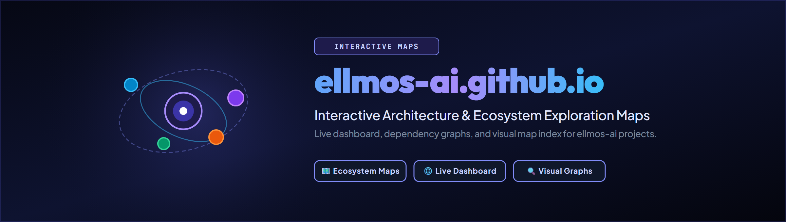
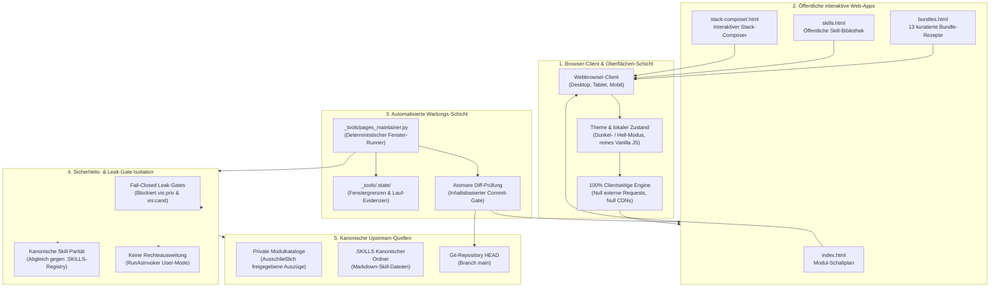
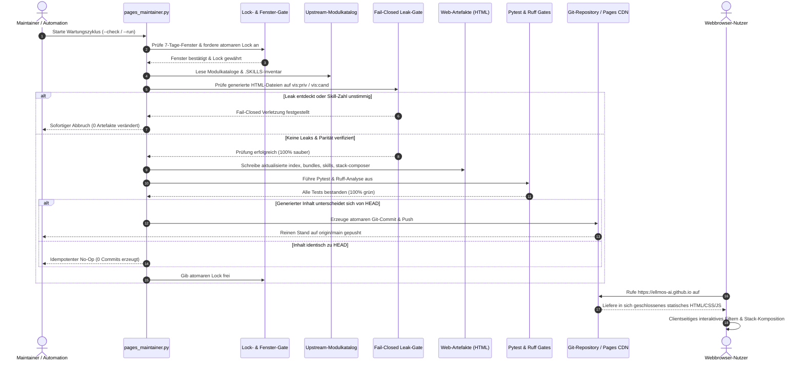

# ellmos-ai.github.io — Interaktive Karten des ellmos-Ökosystems

**Offizielles öffentliches Webportal, interaktive Modul-Schaltpläne, Bundle-Rezepte, Skill-Bibliothek und visueller Stack-Composer für das modulare ellmos KI-Framework.**

<p align="center">
  <a href="https://github.com/ellmos-ai/ellmos-ai.github.io"></a>
  <a href="https://github.com/ellmos-ai/ellmos-ai.github.io/actions/workflows/ci.yml"></a>
  <a href="tests/"></a>
  <a href="https://www.python.org"></a>
  <a href="https://github.com/ellmos-ai/ellmos-ai.github.io"></a>
  <a href="https://ellmos-ai.github.io"></a>
  <a href="SECURITY.md"></a>
  <a href="SECURITY.md"></a>
  <a href="SECURITY.md"></a>
  <a href="https://github.com/astral-sh/ruff"></a>
  <a href="https://github.com/ellmos-ai"></a>
  <a href="https://github.com/open-bricks"></a>
  <a href="llms.txt"></a>
  <a href="https://github.com/ellmos-ai/ellmos-ai.github.io"></a>
  <a href="LICENSE"></a>
</p>

<p align="center"><a href="README.md">English</a> · <strong>Deutsch</strong> · <a href="https://ellmos-ai.github.io">Live-Portal</a></p>

> [!NOTE]
> Für KI-Agenten-Kontext, maschinenlesbare Schemata und architektonische Invarianten siehe [`llms.txt`](llms.txt).
> Alle bereitgestellten Webseiten laufen zu 100% offline im Browser des Nutzers – ohne externe Telemetrie, ohne Tracking und ohne Drittanbieter-CDNs.

---

## Schnellnavigation

- [Interaktive Ökosystem-Übersicht](#interaktive-ökosystem-übersicht)
- [Systemarchitektur & Datenfluss](#systemarchitektur--datenfluss)
- [Wartungs- & Publikationssequenz](#wartungs--publikationssequenz)
- [Seiten- & Funktionsmatrix](#seiten--funktionsmatrix)
- [Governance- & Laufzeit-Invarianten](#governance--laufzeit-invarianten)
- [Pages-Maintainer-Automation](#pages-maintainer-automation)
- [Verifikation & Tests](#verifikation--tests)
- [Geschwister-Tools & Ökosystem](#geschwister-tools--ökosystem)
- [Sicherheitsrichtlinie](SECURITY.md)
- [Drittanbieter-Lizenzen](THIRD_PARTY_LICENSES.md)
- [Marketing-Log](MARKETING-LOG.txt)
- [Änderungsprotokoll](CHANGELOG.md)
- [llms.txt](llms.txt)
- [Lizenz & Governance](#lizenz--governance)

---

## Interaktive Ökosystem-Übersicht

Live erreichbar unter **https://ellmos-ai.github.io**

`ellmos-ai.github.io` dient als öffentliche visuelle Oberfläche des modularen ellmos-Baukastens. Es überführt interne Modulregister, Kompositionsrezepte und KI-Agenten-Skills in benutzer- und maschinenlesbare statische Weboberflächen:

1. **Modul-Schaltplan** ([`index.html`](https://ellmos-ai.github.io)): Visuelles, domänenspezifisch gegliedertes Schaltbild, das Interaktionen und Protokolle zwischen Modulen (MCP-Server, Proxys, Runner, Werkzeuge) darstellt.
2. **Bundle-Rezepte** ([`bundles.html`](https://ellmos-ai.github.io/bundles.html)): Interaktive Übersicht über 13 kuratierte Bereitstellungsrezepte mit klaren Pflicht- und Optionskomponenten für spezifische Agentenprofile.
3. **Skill-Bibliothek** ([`skills.html`](https://ellmos-ai.github.io/skills.html)): Durchsuchbarer Katalog aller öffentlichen Agenten-Skills (`SKILL.md`) mit integriertem Betrachter und Zwischenablage-Funktion.
4. **Stack-Composer** ([`stack-composer.html`](https://ellmos-ai.github.io/stack-composer.html)): Interaktive visuelle Arbeitsfläche zur Zusammenstellung valider Modul-Stacks mit Live-Regelprüfung und Export nach `stack.v2.json`.

---

## Systemarchitektur & Datenfluss



---

## Wartungs- & Publikationssequenz



---

## Seiten- & Funktionsmatrix

| Seite | Datei | Hauptfunktionen | Zielgruppe | Datenschutz & Ausführung |
|---|---|---|---|---|
| **Modul-Schaltplan** | [`index.html`](https://ellmos-ai.github.io) | Visuelle Darstellung funktionaler Cluster, Modulsuche, Tooltips mit Modulzweck, zweisprachige Beschreibungen. | Entwickler, Architekten, KI-Agenten | 100% clientseitiges Rendering, null Telemetrie |
| **Bundle-Rezepte** | [`bundles.html`](https://ellmos-ai.github.io/bundles.html) | 13 vorkomponierte Ökosystem-Rezepte, Komponenten-Aufschlüsselung, Modulstufen (Pflicht / Optional). | Systemintegratoren, Teams | Reine statische Tabellen, sofortiger Offline-Filter |
| **Skill-Bibliothek** | [`skills.html`](https://ellmos-ai.github.io/skills.html) | Direkter Betrachter für öffentliche `SKILL.md`-Dokumente, thematische Gliederung, Markdown-Kopierfunktion. | Prompt-Engineers, Agenten | Lokaler DOM-Reader, null externe APIs |
| **Stack-Composer** | [`stack-composer.html`](https://ellmos-ai.github.io/stack-composer.html) | Visuelle Arbeitsfläche zum Zusammenstellen von Stacks, Live-Validierung von Kompatibilitätsregeln, Export nach `stack.v2.json`. | Framework-Ingenieure, DevOps | Im Browser generiertes JSON, direkter Download |

---

## Governance- & Laufzeit-Invarianten

Das Projekt garantiert 10 verbindliche Betriebs- und Architektur-Invarianten:

| Invarianten-ID | Garantie | Spezifikation & Implementierungsdetails | Sicherheits- & Betriebsvorteil |
|---|---|---|---|
| `INV-STATIC-01` | **100% Static- & Zero-Egress-Invariante** | Alle Webseiten (`index.html`, `bundles.html`, `skills.html`, `stack-composer.html`) sind autarke statische Dokumente ohne externe Telemetrie, Tracking-Skripte oder Fremd-CDNs. | Vollständige Privatsphäre; das Nutzungsverhalten und zusammengestellte Stacks verbleiben auf dem lokalen Gerät. |
| `INV-LEAK-02` | **Fail-Closed Leak-Gates** | Die Maintainer-Suite (`_tools/pages_maintainer.py`) prüft Web-Artefakte vor der Publikation strikt gegen die Kanonik. Funde von `vis:"priv"` oder `vis:"cand"` stoppen den Lauf sofort. | Vollständiger Schutz vor unbeabsichtigter Veröffentlichung interner Modul-IDs oder Entwicklungsstände. |
| `INV-CATALOG-03` | **Kanonische Katalog-Parität** | Skill-Zahlen und Modulinventare müssen exakt mit der kanonischen `.SKILLS`-Registry und dem Modulverzeichnis übereinstimmen. | Garantiert, dass die öffentliche Dokumentation stets 100% synchron mit den tatsächlichen Fähigkeiten ist. |
| `INV-RUNAS-04` | **Local-First & Keine Rechteausweitung (User-Mode)** | Alle Build- und Wartungsskripte laufen unprivilegiert im regulären Benutzerkontext (`RunAsInvoker`). Administrator- oder Root-Rechte werden weder benötigt noch angefordert. | Sichere Ausführung nach dem Least-Privilege-Prinzip ohne Risiko von Rechteausweitungen auf Entwicklergeräten oder CI-Runnern. |
| `INV-WINDOW-05` | **Deterministische 7-Tage-Fenster-Wartung** | Automatisierte Wartungsläufe sind strikt an deterministische 7-Tage-Fenster (montags verankert) gebunden und mit den Läufen des `system-auditor` synchronisiert. | Vorhersehbare Wartungszyklen ohne überflüssige Unruhe oder erratische Mikro-Commits. |
| `INV-DIFF-06` | **Atomare inhaltsbasierte Commits** | Git-Commits werden ausschließlich erzeugt, wenn sich verifizierte, leak-geprüfte Seiteninhalte tatsächlich von HEAD unterscheiden. | Saubere, nachvollziehbare Commit-Historie ohne leere Geister-Commits oder reine Zeitstempel-Verschiebungen. |
| `INV-LOCK-07` | **Fail-Closed Lock-Disziplin** | Transaktionale Sperrdateien (`LOCK.pages-maintainer.txt`, kanonische LOCK-Systemregeln) verhindern Nebenläufigkeitskonflikte und stellen atomare Abläufe sicher. | Zuverlässiger Schutz vor Dateibeschädigungen durch gleichzeitige Generatorläufe in Multi-Agenten-Umgebungen. |
| `INV-OS-08` | **Multi-OS Plattformparität & Smoke-Integrität** | Automatisierter GitHub Actions CI-Workflow über `ubuntu-latest`, `windows-latest` und `macos-latest` auf Python 3.10-3.13 mit Bytecode-Kompilierung und Ruff-Linter. | Nahtlose plattformübergreifende Zuverlässigkeit für alle Skripte und Verifikations-Routinen. |
| `INV-CLIENT-09` | **Reine clientseitige statische Ausführung** | Dunkel-/Hell-Modus, Filter der Modulkarte, Bundle-Inspektion und Stack-Composer laufen vollständig in clientseitigem JavaScript ohne Server-Backend. | Extrem schnelle Ladezeiten, null Serverinfrastruktur-Kosten und robuste Offline-Nutzbarkeit. |
| `INV-SLA-10` | **48h Antwort- & 5-Tage-Triage-SLA** | Verbindliche 48-Stunden-Eingangsbestätigung sowie vollständige Triage- und Behebungszusage innerhalb von 5 Werktagen. | Professioneller, verlässlicher Sicherheits- und Schwachstellenmeldeprozess auf Enterprise-Niveau. |

---

## Pages-Maintainer-Automation

Das Repository enthält ein dezidiertes Wartungsskript, welches die generierten Webseiten an das 7-Tage-Fenster des `system-auditor` koppelt. Es führt Generatoren aus, validiert Leak-Gates und committet Änderungen atomar:

```powershell
# Vorab-Prüfung ohne Dateimodifikationen
$env:PYTHONIOENCODING='utf-8'
python _tools/pages_maintainer.py --check

# Generierung ausführen und Web-Artefakte prüfen
python _tools/pages_maintainer.py --run

# Generierung ausführen und geprüfte Änderungen auf origin/main pushen
python _tools/pages_maintainer.py --run --push
```

Anweisungen für Ausfall-Automationen und Übergabe-Richtlinien sind in [`_tools/FALLBACK-AUTOMATION.md`](_tools/FALLBACK-AUTOMATION.md) dokumentiert.

---

## Verifikation & Tests

Das Repository erzwingt automatisierte Vertragsprüfungen über Pytest und Ruff-Linting:

```powershell
# Ruff statische Code-Analyse ausführen
$env:PYTHONIOENCODING='utf-8'
python -m ruff check .

# Python Bytecode-Integrität kompilieren
python -m compileall -q _tools tests

# Vollständige automatisierte Testsuite ausführen
python -m pytest -ra -v
```

Die Verifikation umfasst:
- CI-Workflow-Konfiguration und Multi-OS-Matrix
- PEP 621 Metadaten-Vollständigkeit und URLs
- Zweisprachige Sicherheitsrichtlinie und 48h/5d SLA-Zusagen
- Existenz und Mindestgröße der statischen Web-Artefakte
- Leak-Gate-Invariante gegen private Sichtbarkeitsmarker
- Zweisprachige README- und Anker-Parität
- Integrität der KI-Agenten-Referenzen (`llms.txt`)
- Multi-Host-Synchronisationskonflikte und Sperrdatei-Regeln in `.gitignore`

---

## Geschwister-Tools & Ökosystem

`ellmos-ai.github.io` visualisiert und vernetzt das modulare Werkzeug-Ökosystem über `ellmos-ai`, `dev-bricks`, `file-bricks`, `doc-bricks` und `open-bricks`:

| Tool | Repository | Schwerpunkt & Rolle im Ökosystem |
|---|---|---|
| **coma** | [ellmos-ai/coma](https://github.com/ellmos-ai/coma) | Multi-Agent Job Board & Provider-Routing-Bridge |
| **clutch** | [ellmos-ai/clutch](https://github.com/ellmos-ai/clutch) | Provider-neutrales Routing für Einzelaufgaben |
| **MarbleRun** | [ellmos-ai/MarbleRun](https://github.com/ellmos-ai/MarbleRun) | Sequenzielle Agenten-Schleifen & Kettenausführung |
| **policy-registry** | [ellmos-ai/policy-registry](https://github.com/ellmos-ai/policy-registry) | Policy-Governance & Berechtigungs-Autorität |
| **system-explorer** | [ellmos-ai/system-explorer](https://github.com/ellmos-ai/system-explorer) | Systemweite Topologie & Stack-Inspektion |
| **sqlite-transit-sync** | [ellmos-ai/sqlite-transit-sync](https://github.com/ellmos-ai/sqlite-transit-sync) | Sichere SQLite-Snapshot- & Sync-Pipeline |
| **workflowhooker** | [ellmos-ai/workflowhooker](https://github.com/ellmos-ai/workflowhooker) | Workflow-Hooking & Lifecycle-Event-Interceptor |
| **memoryhooker** | [ellmos-ai/memoryhooker](https://github.com/ellmos-ai/memoryhooker) | Agenten-Gedächtnis-Injektion & Provenienz-Tracking |
| **swarm_ai** | [ellmos-ai/swarm_ai](https://github.com/ellmos-ai/swarm_ai) | LLM-Schwarmintelligenz & Konsens-Voting-Toolkit |
| **ellmos-filecommander-mcp** | [ellmos-ai/ellmos-filecommander-mcp](https://github.com/ellmos-ai/ellmos-filecommander-mcp) | Local-First FileCommander MCP-Server |
| **ellmos-codecommander-mcp** | [ellmos-ai/ellmos-codecommander-mcp](https://github.com/ellmos-ai/ellmos-codecommander-mcp) | Local-First CodeCommander MCP-Server |
| **ellmos-controlcenter-mcp** | [ellmos-ai/ellmos-controlcenter-mcp](https://github.com/ellmos-ai/ellmos-controlcenter-mcp) | Zentrales Steuerzentrum für KI-Tools & Profile |
| **DevCenter** | [dev-bricks/DevCenter](https://github.com/dev-bricks/DevCenter) | Entwickler-Arbeitsplatz-Hub & Prozesssteuerung |
| **CodeBox** | [dev-bricks/CodeBox](https://github.com/dev-bricks/CodeBox) | Mehrsprachige Code-Ausführung & Plugin-Plattform |
| **ProFiler** | [file-bricks/ProFiler](https://github.com/file-bricks/ProFiler) | Local-First Datei-Analyse & Datenschutz-Ampel |
| **open-bricks** | [open-bricks/open-bricks](https://github.com/open-bricks) | Dachorganisation für offene Entwicklerwerkzeuge |

---

## Sicherheitsrichtlinie & Datenschutz-SLA

`ellmos-ai.github.io` garantiert eine 100% Zero-Egress statische Ausführung. Vollständige Sicherheitshinweise, Meldewege für Schwachstellen, unterstützte Versionen sowie unser verbindliches 48-Stunden-Antwort- / 5-Tage-Triage-SLA finden Sie in [`SECURITY.md`](SECURITY.md).

---

## Lizenz & Governance

Bereitgestellt unter den Bedingungen der **MIT-Lizenz** — siehe [LICENSE](LICENSE) für Details.
Hinweise zu Drittanbieter-Komponenten und Freigaben sind in [THIRD_PARTY_LICENSES.md](THIRD_PARTY_LICENSES.md) dokumentiert.
Projektbezogene Marketing-, Auffindbarkeits- und Keyword-Einträge werden in [MARKETING-LOG.txt](MARKETING-LOG.txt) gepflegt.
